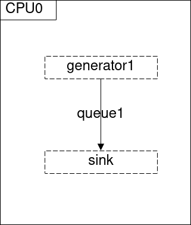
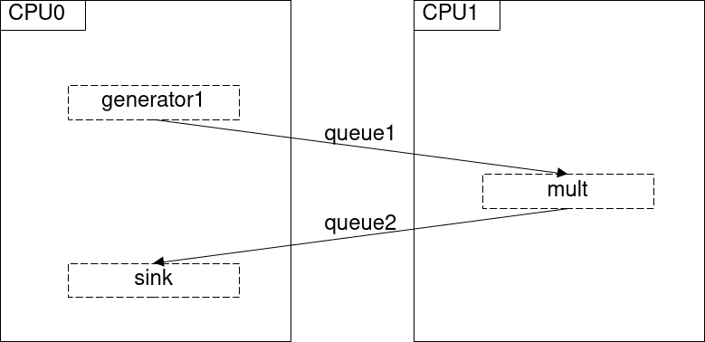
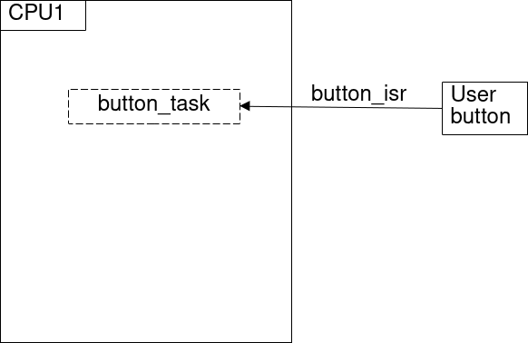
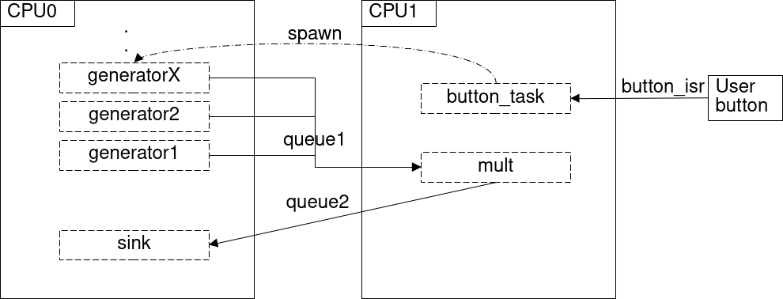

# First RTOS application

In the previous sessions, we discovered the basis of all RTOSes, i.e., the task scheduler.
We implemented a very basic time-slicing scheduler in a bare-metal environment to illustrate the concepts learned in the theoretical sessions.
To that end, we learned how to generate hardware interrupts to periodically activate our scheduler.

In this session, we will use the ESP-IDF, which is an SDK built on-top of [FreeRTOS](https://www.freertos.org/index.html), a widely
used RTOS. 
Other well-known RTOSes such as [RiotOS](https://www.riot-os.org/) or [Zephyr](https://www.zephyrproject.org/) could be used, but ESP-IDF is maintained by Espressif, the producer of the ESP SoCs, hence its usage ensures the best compatibility with our board.

> ESP-IDF maintains its [own version of the FreeRTOS documentation](https://docs.espressif.com/projects/esp-idf/en/v5.0.1/esp32s3/api-reference/system/freertos.html#),
> but the [official FreeRTOS documentation](https://www.freertos.org/a00106.html) is also relatable since ESP-IDF is built on-top of it.

The goals of this session are the following:
- [ ] Plan periodic and aperiodic tasks by leveraging the RTOS scheduler.
- [ ] Discover task synchronization mechanisms such as mutexes and semaphores.
- [ ] Share data between tasks with data queues.
- [ ] Discover multicore programming in RTOS environment.
- [ ] Program hardware interrupts through the RTOS

## Multicore SoC and SMP

The ESP32s3 embeds 2 LX7 Tensica cores, respectively Core0 (PRO_CPU) and Core1 (APP_CPU).
In this session and the next ones, we will leverage the Symmetric Multi-Processing (SMP) paradigm.
In SMP scenarios, each physical core is connected to a shared memory, and a single RTOS
instance is running on the SoC.
This allows the RTOS to schedule tasks on the different cores which are equally treated, i.e., no 
core has a special role.

The ESP-IDF embeds various modifications of FreeRTOS to support SMP.

A sample [`main.c`](first_rtos_app/main/main.c) looks like this:

```c
#include "freertos/FreeRTOS.h"

void app_main(void) {
    printf("Hello from ESP-IDF.\n");
}
```

and the execution of such code results in the following logs:

```console
ESP-ROM:esp32s3-20210327
Build:Mar 27 2021
rst:0x1 (POWERON),boot:0x28 (SPI_FAST_FLASH_BOOT)
SPIWP:0xee
mode:DIO, clock div:1
load:0x3fce3810,len:0x1678
load:0x403c9700,len:0xbe0
load:0x403cc700,len:0x2e34
entry 0x403c9900
I (25) boot: ESP-IDF v5.1-dev-3101-g1195b6cb2b 2nd stage bootloader
I (25) boot: compile time Mar 13 2023 09:19:23
I (25) boot: chip revision: v0.1
I (29) boot.esp32s3: Boot SPI Speed : 80MHz
I (34) boot.esp32s3: SPI Mode       : DIO
I (39) boot.esp32s3: SPI Flash Size : 2MB
I (44) boot: Enabling RNG early entropy source...
I (49) boot: Partition Table:
I (53) boot: ## Label            Usage          Type ST Offset   Length
I (60) boot:  0 nvs              WiFi data        01 02 00009000 00006000
I (67) boot:  1 phy_init         RF data          01 01 0000f000 00001000
I (75) boot:  2 factory          factory app      00 00 00010000 00100000
I (82) boot: End of partition table
I (86) esp_image: segment 0: paddr=00010020 vaddr=3c020020 size=09770h ( 38768) map
I (102) esp_image: segment 1: paddr=00019798 vaddr=3fc91900 size=02450h (  9296) load
I (105) esp_image: segment 2: paddr=0001bbf0 vaddr=40374000 size=04428h ( 17448) load
I (116) esp_image: segment 3: paddr=00020020 vaddr=42000020 size=1a7f8h (108536) map
I (140) esp_image: segment 4: paddr=0003a820 vaddr=40378428 size=09470h ( 38000) load
I (154) boot: Loaded app from partition at offset 0x10000
I (154) boot: Disabling RNG early entropy source...
I (166) cpu_start: Pro cpu up.
I (166) cpu_start: Starting app cpu, entry point is 0x4037521c
I (0) cpu_start: App cpu up.
I (180) cpu_start: Pro cpu start user code
I (180) cpu_start: cpu freq: 160000000 Hz
I (180) cpu_start: Application information:
I (183) cpu_start: Project name:     first_rtos_app
I (189) cpu_start: App version:      1
I (193) cpu_start: Compile time:     Mar 13 2023 09:19:17
I (199) cpu_start: ELF file SHA256:  2ca3ee5eb2c4f0da...
I (205) cpu_start: ESP-IDF:          v5.1-dev-3101-g1195b6cb2b
I (212) cpu_start: Min chip rev:     v0.0
I (216) cpu_start: Max chip rev:     v0.99 
I (221) cpu_start: Chip rev:         v0.1
I (226) heap_init: Initializing. RAM available for dynamic allocation:
I (233) heap_init: At 3FC94780 len 00054F90 (339 KiB): DRAM
I (239) heap_init: At 3FCE9710 len 00005724 (21 KiB): STACK/DRAM
I (246) heap_init: At 3FCF0000 len 00008000 (32 KiB): DRAM
I (252) heap_init: At 600FE010 len 00001FF0 (7 KiB): RTCRAM
I (259) spi_flash: detected chip: gd
I (263) spi_flash: flash io: dio
W (267) spi_flash: Detected size(8192k) larger than the size in the binary image header(2048k). Using the.
I (280) app_start: Starting scheduler on CPU0
I (285) app_start: Starting scheduler on CPU1
I (285) main_task: Started on CPU0
I (295) main_task: Calling app_main()
Hello from ESP-IDF.
I (301) main_task: Returned from app_main()
```

As we can see in the boot process logs, the kernel initializes both CPU then starts a scheduler on each one.

### Part 1 : Sharing data between tasks

There exists multiple ways to share data between RTOS tasks, but the simplest way is using [data Queues](https://www.freertos.org/Embedded-RTOS-Queues.html).

In this exercise, we will illustrate the usage of such queue to share data between to simple tasks.

> Goal : Simple (a)periodic task scheduling + inter-task communication through queues



1. Fill-in the body of the `generator` and `sink` functions.
2. Configure a queue in the `setup` function.
3. Schedule 1 task "generator1" of type `generator` and 1 task "sink" of type `sink`.
    - Both tasks **must** be pinned to CPU0.
    - The queue **must** be passed by reference in the task's arguments.

*Hints*
- Each task has a separate stack, hence passing a pointer defined on a task's stack to another task
will not work. You should define your shared structure in global variables.
- Take a look at the [Task API ](https://docs.espressif.com/projects/esp-idf/en/v5.0.1/esp32s3/api-reference/system/freertos.html#task-api) and [Queue API](https://www.freertos.org/a00018.html) to implement this part of the session.

### Part 2 : Multicore setup

Having two separate cores on the same SoC allows running two tasks at the same time. 
To illustrate this ability, we will schedule a new task on CPU1 of our ESP32s3 SoC.

> Goal : Leverage the SMP system + aperiodic task setup



1. Define a struct `mult_args` storing references to the input and output queues of the `mult` function.
2. Configure a second Queue in the `setup` function to connect the `mult` task to the `sink` one.
3. Implement the body of the `mult` function. It double each entry of the input stream and send them in the output stream.
4. Schedule a task "mult1" of type `mult`.
    - This task **must** be pinned to CPU1.
    - The queue **must** be passed by reference in the task's arguments.

### Part 3 : Tasks synchronization

Until now, all the tasks started at random.
In our producer-consumer scenario, we want to ensure that the consuming tasks are running before
launching the producer.
To that end, we will leverage binary semaphores.

> Goal : Use binary semaphores for tasks synchronization

1. Configure a binary semaphore `sink_sem` in the `setup` function
2. Modify the body of the `sink` function to release the semaphore at function startup
3. Modify the body of the `mult` function to capture the semaphore at function startup
4. Repeat steps 1-3 to synchronize the `generator` function with the `mult` function.

*Hints*
- You should use the [semaphore API](https://www.freertos.org/a00113.html)

### Part 4 : GPIO 

In the previous parts of this sessions, we scheduled a periodic task and two aperiodic tasks triggered by presence of data in queues.

We will now show that tasks can also be triggered by external signals, such as interrupts generated by GPIO.

> Goal : Use aperiodic task triggered by an interrupt



1. Configure the user button GPIO in the `setup` function.
    - Configure the GPIO pin
    - Configure a `button_sem` binary semaphore
    - Install the `button_isr` ISR on the GPIO
2. Implement the `button_isr` ISR
3. Implement the aperiodic task `button_task`

*Hints*
- You should use the [GPIO API](https://docs.espressif.com/projects/esp-idf/en/v5.0.1/esp32s3/api-reference/peripherals/gpio.html)

### Part 5 : Add generating tasks on demand

Until now, we used binary semaphore to represent "on-off" states.
However, semaphore can also be used to count "events" and (un)block tasks when a specified limit is reached.

> Goal : Use counting semaphore to limit resources attribution



1. Configure a counting semaphore `count` in the `setup` functions with a maximum value of 5
2. Modify `button_task` to register a new `generator` task upon button press
    - This function must add **at most** 5 tasks
    - The id of the spawned tasks must be formatted as "generator<count value>"

## Rust introduction (III)

Do the [following exercises](https://lighthearted-llama-a670af.netlify.app/exercises/course-4/afternoon.html).
